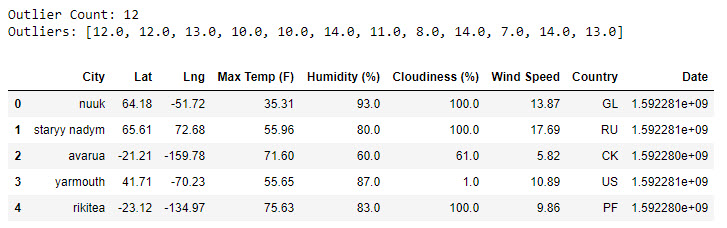
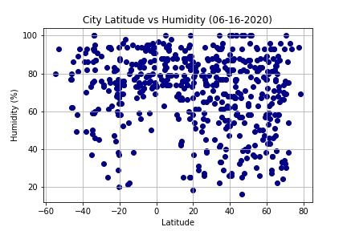

# python-api-challenge
## WeatherPy

### Summary
The objective of this work is to visualize the weather of 500+ cities across the world of varying distance from the equator.
The following are the conclusions of the analysis:

### Data Analysis
#### Getting the Data
Data was randomly selected from OpenWeatherMap API where information about cities and their respective latitude, longitude, maximum temperature, humidity, cloudiness, wind speed, country and date was retreived. Table below shows a sample of the data.

#### Inspecting the Data
Cities with humidity higher than 100% were removed from the dataset. The basic statistics of data is shown in the table below.

Ten outliers for Humidity were removed, and the final cleaned dataframe was created. Table below shows a sample of the results.

#### Plotting the Data

The latitude vs temperature plot below shows how the temperature increases as latitude is closer to the Equator.

The latitude vs humidity plot below shows humidities above 50% around the Equator ~10 to 10degrees, but for the rest od the latitudes humidty can vay from 5 to 100%. There is no apparent correlation.

## VacationPy
