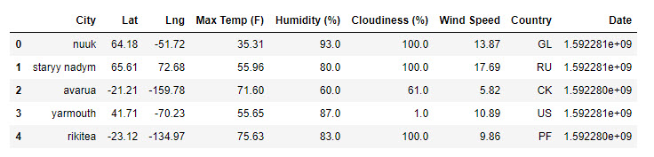
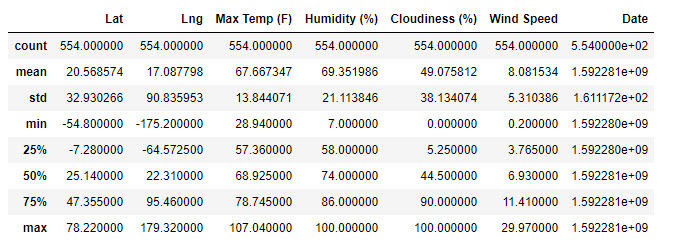
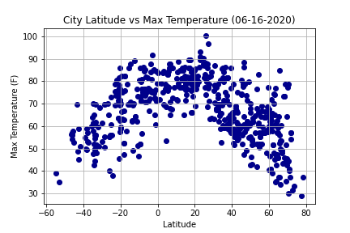
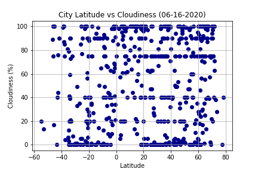
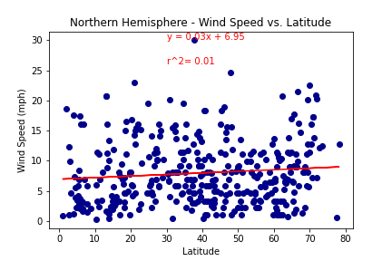
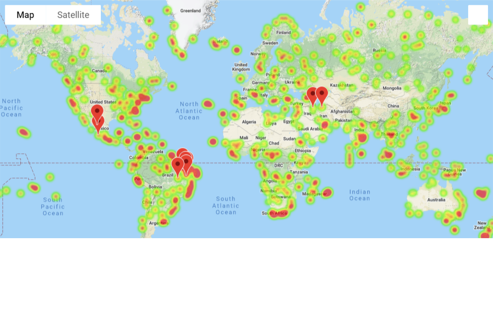
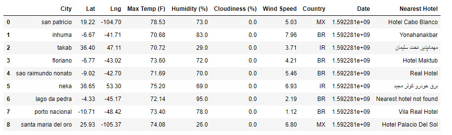

# python-api-challenge
## WeatherPy

### Summary
The objective of this work is to visualize the weather of 500+ cities across the world of varying distance from the equator.
The following are the conclusions of the analysis:
* There is correlation with latitude and temperature: as latitude gets closer to the Equator, temperatures are higher.
* There is no direct correlation between latitude and humidity, cloudiness or wind speed.

### Data Analysis
#### Getting the Data
Data was randomly selected from OpenWeatherMap API where information about cities and their respective latitude, longitude, maximum temperature, humidity, cloudiness, wind speed, country and date was retreived. Table below shows a sample of the data.

#### Inspecting the Data
Cities with humidity higher than 100% were removed from the dataset. The basic statistics of data is shown in the table below.

Two outliers for Humidity were removed, and the final cleaned dataframe was created. Table below shows a sample of the results.

#### Plotting the Data

The latitude vs temperature plot below shows how the temperature increases as latitude is closer to the Equator.

The latitude vs humidity plot below shows humidities above 50% around the Equator ~10 to 10degrees, but for the rest of the latitudes humidty can vay from 5 to 100%. There is no apparent correlation.

The latitude vs cloudiness plot below shows no correlation, data is very sparced.

The latitude vs wind speed plot below shows no correlation, data is very sparced.

### Comparing Northern and Southern Hemispheres

The Northern Hemisphere Maximum Temperature vs Latitude plot shows a negative correlation, temperature decreases as latitude increases. The r^2 is low, but still the tendency can be seen and it correponds to what is expected.

The Southern Hemisphere Maximum Temperature vs Latitude plot shows a positive correlation, temperature increases as negative latitude increases, supported by a fair r^2.

The Northern Hemisphere Humidity vs Latitude plot shows a  very low  r^2 is so there is no correlation.

The Southern Hemisphere Humidity vs Latitude plot shows aa  very low  r^2 is so there is no correlation.

The Northern Hemisphere Cloudiness vs Latitude plot shows no correlation.

The Southern Hemisphere Cloudiness vs Latitude plot shows no correlation.

The Northern Wind Speed vs Latitude plot shows no correlation.

The Southern Hemisphere Wind Speed vs Latitude plot shows no correlation.

## VacationPy

### Summary
The goal of the following routine is to find hotels in the ideal place in terms of weather.

### Humidity Heatmap
A humdity heat map was created for random cities across the world.

Cities were selected if they met the following ideal conditions:
* Max Temperature between 70 and 80F
* Wind Speed <10mph
* Cloudiness is 0

Nine cities met the requirements:

The following hotels were selected for each city:

The map of the locations is presented below.

